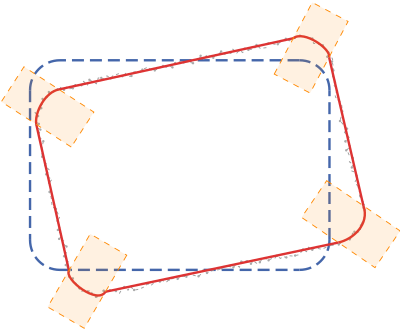
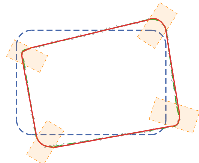
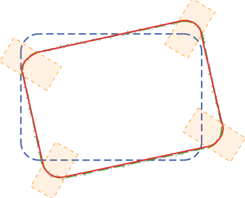
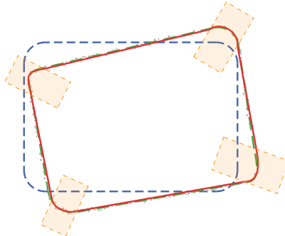
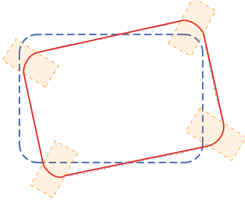
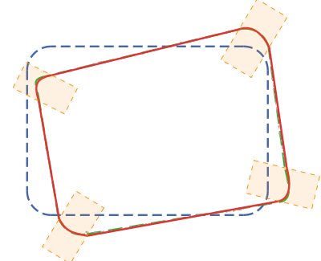
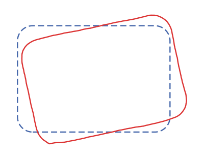
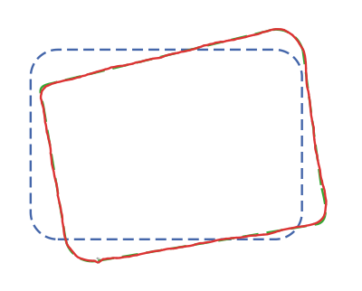

# ComputeCorrections() — Test Results

PCA alignment + per-segment correction on a rounded rectangle 100x70 r=10.

**Shared parameters:** noise=1.0, dropout=10%, rotation=12°, translation=(15, -10)

**Legend:** blue dashed = template, green dashed = perturbed template, gray = measured polyline, red solid = corrected, orange = filter rect

## Results Summary

| Test | Correction Accuracy | Max Point Disp. | Max Key Pt Disp. | Rotation |
|------|----:|----:|----:|----:|
| **Smoothed — Unmodified** | **0.94** | 0.94 | 2.08 | -167.40° |
| **Unmodified** | **1.04** | 1.04 | 3.99 | -167.39° |
| **Smoothed — Perturbed** | **1.30** | 3.41 | 3.47 | 12.83° |
| Densified Polyline — Unmodified | 1.53 | 1.53 | 2.30 | 12.58° |
| Perturbed | 1.54 | 3.24 | 5.00 | 12.82° |
| Densified Polyline — Perturbed | 1.64 | 3.57 | 3.57 | 12.83° |
| Polyline Shift — Unmodified | 1.87 | 1.56 | 2.51 | -166.99° |
| Polyline Shift — Perturbed | 2.97 | 3.87 | 5.57 | 13.41° |

*Sorted by correction accuracy (lower = better). Bold = best per category.*

---

## Unmodified Template

noise=1.0 | dropout=10% | rot=12° | tx=15, ty=-10

---

## Perturbed Key Points

2 corners perturbed ±5 | noise=1.0 | dropout=10% | rot=12°

---

## Polyline Shift — Unmodified Corners

Edges shifted ±3 | corners reconstructed via κ | noise=1.0 | rot=12°

---

## Polyline Shift — Perturbed Corners

Edges shifted ±3 | corners perturbed ±4 | noise=1.0 | rot=12°

---

## Smoothed — Unmodified Template

noise=1.0 | smoothed (window=3) | dropout=10% | rot=12° | tx=15, ty=-10

---

## Smoothed — Perturbed Key Points

2 corners perturbed ±5 | noise=1.0 | smoothed (window=3) | rot=12°

---

## Densified Polyline — Unmodified

Template densified (unit=0.5) as pure polyline | smoothed (window=3) | noise=1.0 | rot=12°

---

## Densified Polyline — Perturbed Key Points

Template densified (unit=0.5) as pure polyline | 2 corners perturbed ±5 | smoothed (window=3) | noise=1.0 | rot=12°

---

## Key Findings

1. **Smoothed Bezier wins** — correction accuracy 0.94 (unmodified) and 1.30 (perturbed). Bezier least-squares fitting acts as a second smoothing pass on corners.

2. **Densified polyline is competitive** but slightly worse (1.53 / 1.64). Point-by-point projection passes residual noise through 1:1, while Bezier fitting averages it out.

3. **Zero-noise diagnostic** confirms the pipeline is correct — densified polyline with zero noise gives 0.21 deviation (pure discretization error).

4. **Smoothing the measured data** reduces correction accuracy from 1.04 → 0.94 for unmodified, and from 1.54 → 1.30 for perturbed.

## Legend

- **Correction Accuracy** — max Hausdorff distance between corrected curve (in template space) and the source template that generated the measured data. Lower = better.
- **Max Point Displacement** — max Hausdorff distance between corrected curve and the canonical template.
- **Max Key Point Displacement** — max displacement of any key point (polyline vertex or Bezier endpoint/control point).
- **Rotation** — PCA-recovered rotation angle (±180° ambiguity is normal).
